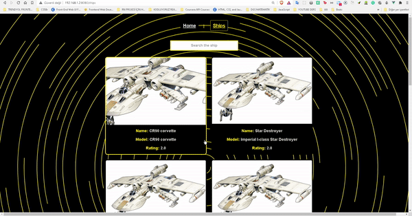

## Trendyol Front End Bootcamp Week 4

<p align="center">

</p>

> api from [swapi.dev](swapi.dev)
> my first project on [Vue](https://cli.vuejs.org/)

### starwars

### Project setup

```
npm install
```

### Compiles and hot-reloads for development

```
npm run serve
```

### Compiles and minifies for production

```
npm run build
```

### Customize configuration

See [Configuration Reference](https://cli.vuejs.org/config/).
